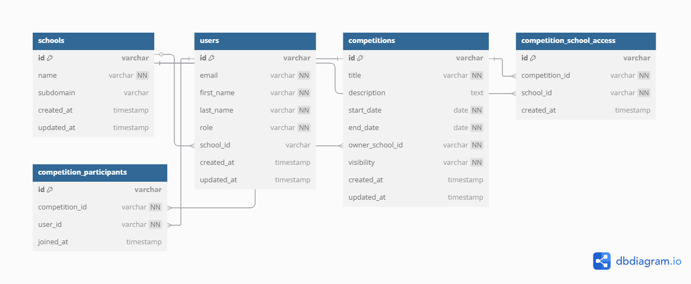

# Multi-Tenant Competition Platform: Architecture Design

## Overview

This document outlines the architecture for a scalable, multi-tenant competition platform that allows schools to create and manage competitions for their students. The platform supports isolated data access between tenants while enabling flexibility in competition visibility and robust role-based permissions.

## Multi-Tenancy Approach

I recommend implementing a **Row-Level Tenant Isolation** approach where:

- Each entity in the system contains a tenant identifier (e.g., `ownerSchoolId` for competitions)
- Data isolation is enforced at both the database and service layers
- Row-Level Security (RLS) in PostgreSQL provides a powerful mechanism to enforce tenant isolation at the database level

This approach offers several advantages:
- Single database instance serving all tenants, simplifying operations
- Strong security boundaries between tenants without complex sharding
- Flexibility to support cross-tenant visibility when needed
- Efficient database utilization with good query performance

## Data Model

The core entities in the system include:

1. **Schools (Tenants)**
   - Each school represents a distinct tenant with isolated data
   - Schools have unique identifiers and subdomains for branded access

2. **Users**
   - Users belong to a specific school (tenant) except for platform admins
   - Role-based permissions (Student, School Admin, Platform Admin)

3. **Competitions**
   - Competitions have an `ownerSchoolId` to identify their tenant
   - Visibility settings control cross-tenant access
   - Support for rich competition metadata

4. **CompetitionSchoolAccess**
   - Junction table supporting restricted competitions
   - Maps competitions to authorized schools for cross-tenant visibility

5. **CompetitionParticipants**
   - Tracks student participation in competitions
   - Enforces tenant boundaries while enabling participation

## Visibility Model

The platform supports three visibility levels for competitions:

1. **Private**: Only visible within the owner school
   - Completely isolated to the tenant (school) that created it
   - Only administrators and students from the owner school can access

2. **Public**: Visible to all schools
   - Available to all tenants in the system
   - Any student can participate regardless of school

3. **Restricted**: Visible to selected schools
   - Controlled cross-tenant visibility
   - Access granted to specific schools using the CompetitionSchoolAccess table

This model balances the need for tenant isolation with the flexibility to allow controlled collaboration between schools.

## Authorization System

The system implements a comprehensive role-based access control (RBAC) system:

1. **Platform Admin**
   - Global administrators with access to all competitions and schools
   - Can manage system-wide settings and monitor all tenant activity

2. **School Admin**
   - Can create and manage competitions for their school
   - Limited to their own school's data with exceptions for public competitions
   - Manage students within their school

3. **Student**
   - Can view and participate in competitions available to their school
   - Access determined by competition visibility and school membership

Access control is enforced at multiple layers:
- Database-level through Row-Level Security policies
- Service-layer through permission checks in API endpoints
- UI-level by conditionally rendering components based on permissions

## Technical Implementation

### Database Schema

The diagram below illustrates the core database schema supporting our multi-tenant architecture:



*Figure 1: Database schema showing relationships between entities with tenant isolation through ownerSchoolId*

Key aspects of this schema:
- The `ownerSchoolId` foreign key in the Competitions table enforces tenant ownership
- Users are associated with their school tenant through the `schoolId` field (null for platform admins)
- The CompetitionSchoolAccess junction table enables controlled cross-tenant visibility
- CompetitionParticipants tracks which students have joined competitions while respecting tenant boundaries


### Database Layer

1. **Row-Level Security (RLS)**
   ```sql
   -- Example policy for competitions table
   CREATE POLICY tenant_isolation_policy ON competitions
     USING (
       owner_school_id = current_setting('app.current_tenant')::uuid
       OR visibility = 'PUBLIC'
       OR (visibility = 'RESTRICTED' AND EXISTS (
         SELECT 1 FROM competition_school_access
         WHERE competition_id = competitions.id
         AND school_id = current_setting('app.current_tenant')::uuid
       ))
     );
   ```

2. **Efficient Indexing**
   ```sql
   -- Indexes for tenant filtering and joins
   CREATE INDEX idx_competitions_owner_school_id ON competitions(owner_school_id);
   CREATE INDEX idx_competitions_visibility ON competitions(visibility);
   CREATE INDEX idx_competition_school_access_competition_id ON competition_school_access(competition_id);
   CREATE INDEX idx_competition_school_access_school_id ON competition_school_access(school_id);
   ```

### API Layer

1. **Tenant Context Middleware**
   ```typescript
   // Set tenant context for database RLS
   const tenantMiddleware = (req, res, next) => {
     const user = req.user;
     if (user && user.schoolId) {
       // Set tenant context for database queries
       pool.query('SET LOCAL app.current_tenant TO $1', [user.schoolId]);
     }
     next();
   };
   ```

2. **Permission-Based Endpoint Access**
   ```typescript
   // School admin only endpoint
   router.post('/competitions', 
     authenticate, 
     tenantMiddleware,
     authorizeRoles(['SCHOOL_ADMIN', 'PLATFORM_ADMIN']), 
     createCompetition
   );
   ```

### Frontend Architecture

1. **Context-Based Authentication and Tenant State**
   ```tsx
   // Provide auth and tenant context to app
   function App() {
     return (
       <AuthProvider>
         <TenantProvider>
           <Router>
             <Routes>
               {/* Routes here */}
             </Routes>
           </Router>
         </TenantProvider>
       </AuthProvider>
     );
   }
   ```

2. **Component-Level Authorization**
   ```tsx
   function CompetitionCard({ competition }) {
     const { user } = useAuth();
     const canEdit = canEditCompetition(user, competition);
     
     return (
       <div>
         {/* Competition info */}
         {canEdit && <EditButton />}
       </div>
     );
   }
   ```

## Scalability Considerations

To support thousands of schools and competitions:

1. **Database Optimization**
   - Efficient indexing on tenant IDs and frequently queried columns
   - Partitioning competition data by tenant for larger deployments
   - Connection pooling to manage database connections efficiently

2. **Caching Strategy**
   - Redis for caching frequently accessed competition listings
   - Competition details cached with cache invalidation on updates
   - School/tenant metadata caching to reduce database load

3. **Horizontal Scaling**
   - Stateless API design enabling load balancing across multiple servers
   - Database read replicas for read-heavy operations
   - CDN for static assets and potentially competition media

## AI Tool Integration

GitHub Copilot and ChatGPT can significantly enhance development workflow:

1. **Code Generation**
   - Generate boilerplate for repetitive components like forms and tables
   - Suggest SQL queries with appropriate tenant isolation
   - Help implement RLS policies for PostgreSQL

2. **Debugging Assistance**
   - Analyze complex multi-tenant access issues
   - Suggest optimization techniques for database queries
   - Identify potential security holes in tenant isolation

3. **Documentation**
   - Generate API documentation with examples
   - Help document tenant isolation patterns
   - Create user guides for different roles

<p align="center">
  Made with ❤️ by [Aakash Priyadarshi](http://aakash-priyadarshi.github.io/)
</p>
